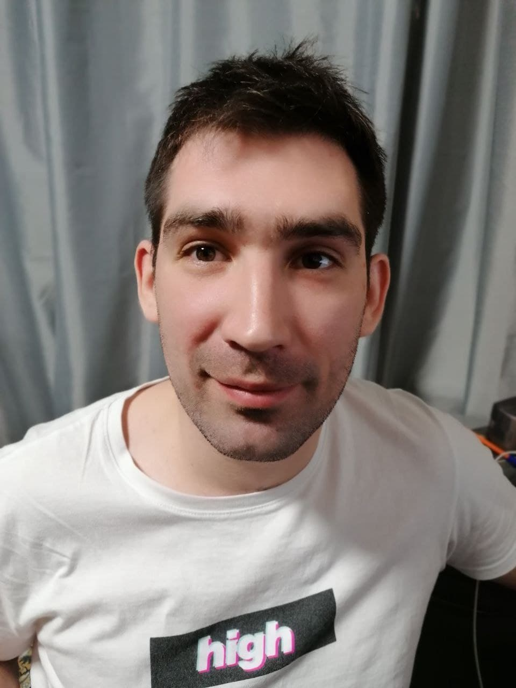

# Konstantin Nepovinnov
*********



## Contacts:
  * __Phone:__ +7(927)00-61-841 
  * __Location:__ Russia, Samara
  * __Email:__ nekonstantin@yandex.ru
  * __GitHub:__ KosTHB
  * __Discord rs-school nickname:__ Konstantin Nepovinnov (@KosTHB)


*********


## About me:
>I am 32 years. I am very inquisitive and every day I study and learn something new for myself. It makes me happy. 
 I set myself the goal of becoming a Frontend developer and step by step is getting closer to its implementation.


## Skills
* HTML
* CSS
* JavaScript (Basic knowledge) 
* Git 
* MySQL (Basic knowledge)
* Windows OS
* Figma(for web development)
* VSCode


## Code Example:
```
function towelSort(matrix) {
  if (!matrix) {
    return [];
  }
  let res = [];
  for (let i = 0; i < matrix.length; i++) {
    if (i % 2 == 0) {
      for (let j = 0; j < matrix[i].length; j++) {
        res.push(matrix[i][j]);
      }
    }
    else {
      for (let j = matrix[i].length - 1; j >= 0; j--) {
        res.push(matrix[i][j]);
      }
    }
  }
  return res;
}

```


*********


## Experience:
__Projects:__
* tic-tac-toe <https://rolling-scopes-school.github.io/kosthb-JSFEPRESCHOOL/tic-tac-toe/>
* audio player <https://rolling-scopes-school.github.io/kosthb-JSFEPRESCHOOL/>
* random quotes <https://rolling-scopes-school.github.io/kosthb-JSFEPRESCHOOL/random-jokes/>
* portfolio <https://rolling-scopes-school.github.io/kosthb-JSFEPRESCHOOL/portfolio/>

## Education:

Samara Academy of Culture and art

* Courses:
    * CS50
    * SoloLearn
    * RS-School JS Front-end development Stage 0

*********


## English:
A2 (*School, Academy, Duolingo*)


